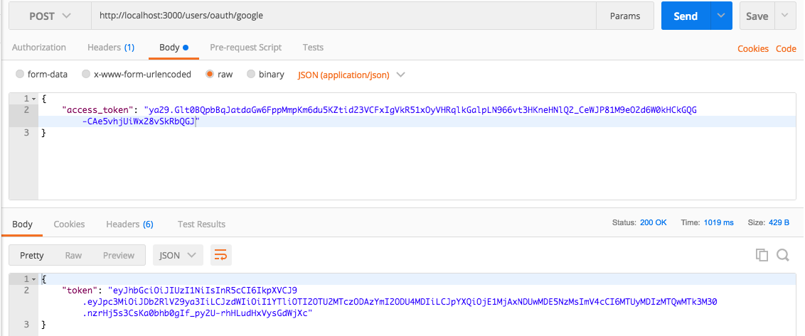

# API Authentication with Node 

This project uses async/await it would be best if you use **node 8+**
after checkout be sure to run

## Demo

```
// public (GET)
https://hkauthapi.herokuapp.com/users

// signup (POST)
https://hkauthapi.herokuapp.com/users/signup

// Signin (POST)
https://hkauthapi.herokuapp.com/users/signin

// Google Auth (POST)
https://hkauthapi.herokuapp.com/users/oauth/google

// Facebook Auth (POST)
https://hkauthapi.herokuapp.com/users/oauth/facebook

// Access Protected Resource (GET)
https://hkauthapi.herokuapp.com/users/secret
```

## In Dev env

```
// public (GET)
https://localhost:3000/users

// signup (POST)
https://localhost:3000/users/signup

// Signin (POST)
https://localhost:3000/users/signin

// Google Auth (POST)
https://localhost:3000/users/oauth/google

// Facebook Auth (POST)
https://localhost:3000/users/oauth/facebook

// Access Protected Resource (GET)
https://localhost:3000/users/secret
```

```bash
$ npm install
```
installing using yarn
```bash
$ yarn install
```
To run the project use
```bash
$ npm run start-dev
```
starting the project using yarn
```bash
$ yarn start
```

run unit tests
```bash
$ yarn test
```

genarate code coverage report
```bash
$ yarn report
```

run unit tests with nyc output in terminal
```bash
$ yarn nyc
```

run unit tests with nyc summery report
```bash
$ yarn text-report
```

##### Code Coverage

|File         |  % Stmts | % Branch |  % Funcs |  % Lines |Uncovered Lines |
|-------------|----------|----------|----------|----------|----------------|
|All files    |      100 |      100 |      100 |      100 |                |
| controllers |      100 |      100 |      100 |      100 |                |
|  users.js   |      100 |      100 |      100 |      100 |                |
| routes      |      100 |      100 |      100 |      100 |                |
|  users.js   |      100 |      100 |      100 |      100 |                |

## Happy Coding!


## Resources

# Postman Workflow

## Local Auth

**Request Payload**


**Response**


## Google Auth

**Step1**
https://developers.google.com/oauthplayground


**Step2**


**Step3**


**Step4**


## Facebook Auth

**Step1**
https://developers.facebook.com/tools/accesstoken/


**Step2**


**Step3**


=========================================================

get access_token

https://developers.google.com/oauthplayground/?code=4/AADfZ3YC-Y3srgKwBzq3qZrZTibnMzzSi7DD26qWcNen8bcTkK8Y8jPyfUkI5toR9kBorbQeVXx7rurKsw2XYkU#

Get API key & Secret
https://console.developers.google.com/apis/credentials?project=nodeapiauth

** Create FB App**
https://developers.facebook.com

** Access token**
https://developers.facebook.com/tools/accesstoken/